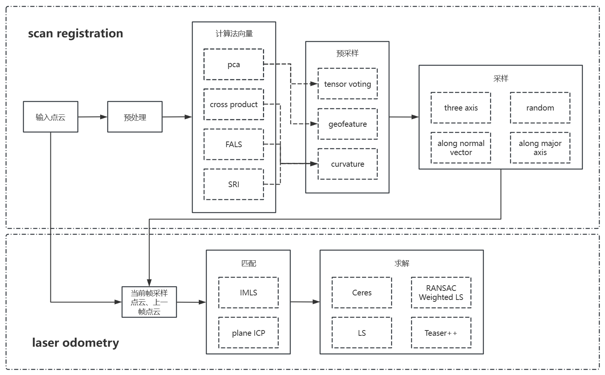
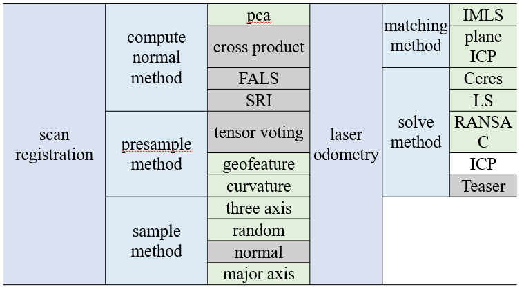

# Planetary SLAM

A modular LiDAR SLAM(currently only odometry part) framework based on A-LOAM, with enhanced features for planetary environments. This project implements 3D IMLS-SLAM and introduces tensor voting for better point cloud processing in sparse, feature-less environments.



## Features

- **Modular Design**: The framework is divided into five main components, each component can be replaced with different methods via configuration:
  - Normal Vector Computation
  - Pre-sampling
  - Sampling
  - Matching
  - Solving

- **Enhanced Algorithms**:
  - 3D IMLS-SLAM implementation (first open-source 3D version)
  - Extended tensor voting with decomposed tensor voting from set A to set B
  - Multiple solving methods including RANSAC, Weighted LS, etc.

- **Configurable**: All parameters can be configured through `config.json`
- **Visualization**: Supports intermediate results saving and timing analysis
- **ROS Integration**: Compatible with ROS Melodic

## Prerequisites

### System Requirements
- Ubuntu 18.04
- ROS Melodic
- C++17 compiler

### Dependencies
```bash
# ROS packages
sudo apt-get install ros-melodic-desktop-full

# Essential libraries
sudo apt-get install \
  libeigen3-dev \
  libpcl-dev \
  libopencv-dev \
  libceres-dev \
  libgoogle-glog-dev \
  libboost-all-dev \
  libomp-dev \
  nlohmann-json-dev

# Additional libraries
# libpointmatcher
git clone https://github.com/ethz-asl/libpointmatcher.git
cd libpointmatcher && mkdir build && cd build
cmake ..
make -j4
sudo make install

# TEASER++
git clone https://github.com/MIT-SPARK/TEASER-plusplus.git
cd TEASER-plusplus && mkdir build && cd build
cmake ..
make -j4
sudo make install

# CSF
# Please follow CSF installation instructions from their repository
```

## Supported Hardware & Datasets

### LiDAR Sensors
- Velodyne VLP-16
- Velodyne HDL-32
- Velodyne VLP-32C
- Velodyne HDL-64

### Datasets
- KITTI Dataset (ROS bag format)
- Planetary scenes: AMEDS (Arches Mount Etna) Dataset and Erfoud Dataset (ROS bag format) (tested but yielded suboptimal results)
- Supports direct processing of KITTI odometry dataset converted to ROS bag format
- Data format: `/velodyne_points` topic (sensor_msgs/PointCloud2)

## Build

```bash
# Create a catkin workspace
mkdir -p ~/catkin_ws/src
cd ~/catkin_ws/src

# Clone the repository
git clone https://github.com/yourusername/planetary_slam.git

# Build
cd ~/catkin_ws
catkin_make
```

## Usage

```bash
# Source workspace
source ~/catkin_ws/devel/setup.bash

# Launch with VLP-32 configuration
roslaunch planetary_slam planetary_slam_VLP_32.launch

# Play KITTI rosbag
rosbag play your_kitti_sequence.bag
```

## Current Status



- Green methods: Verified working on KITTI dataset
- Gray methods: Currently experiencing issues
- Performance: Currently running slower than expected, optimization needed

## Applications

- Reference for SLAM framework development
- IMLS and tensor voting components can be used independently
- Research platform for sparse point cloud processing in planetary environments

## Known Issues

1. Performance optimization needed
2. Some methods still need debugging (see gray items in results)
3. Limited effectiveness in extremely sparse planetary environments

## Notes

This project was initially designed to address sparse and featureless point clouds in planetary environments using IMLS and tensor voting. While the current results in planetary environments are not optimal, the framework and implementations are shared for academic purposes and further development.
